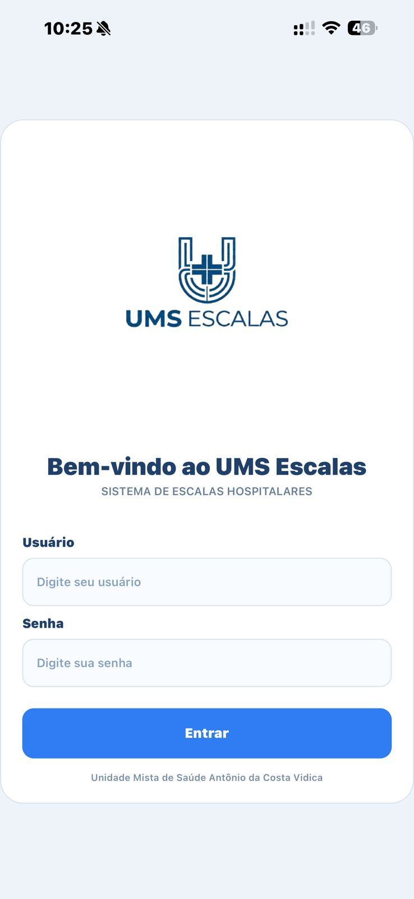
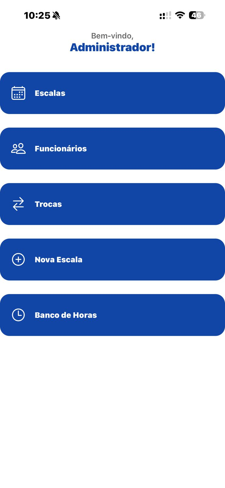
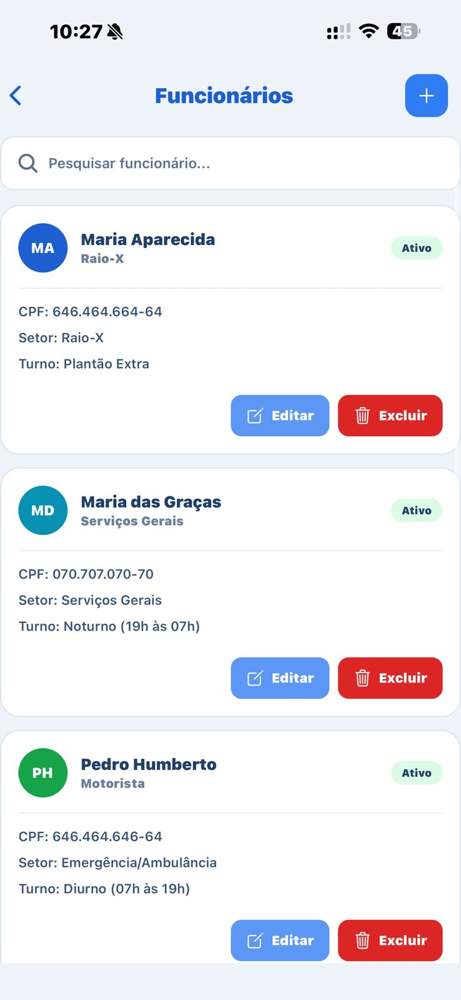
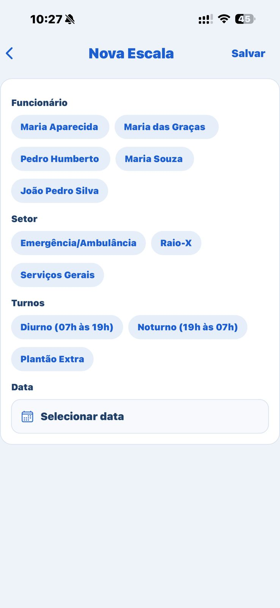
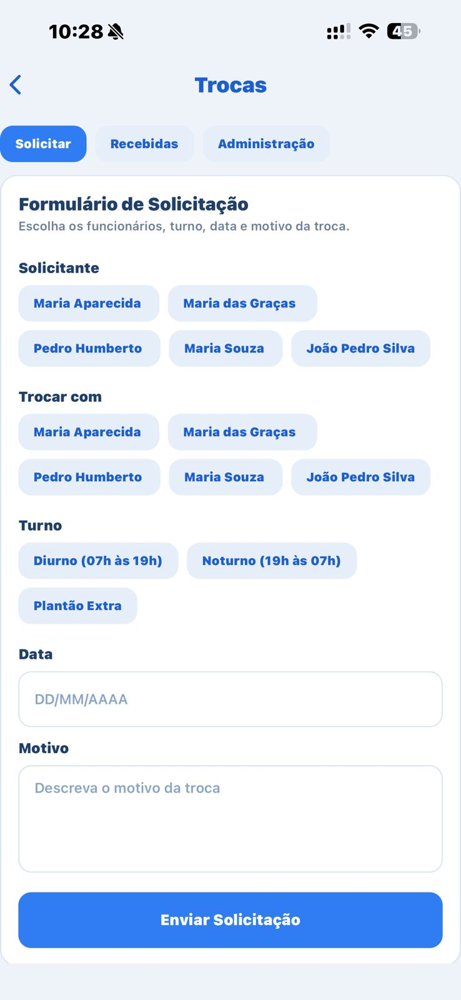

# 🏥 UMS Escalas
## 🚧 Status do projeto

Em desenvolvimento.

Atualmente estou implementando a integração com Supabase para persistência de dados, autenticação e estruturação do backend.
Aplicativo mobile desenvolvido para gestão de escalas hospitalares.

---

## 🚀 Tecnologias

- React Native
- Expo
- JavaScript
- Supabase

---

## 📱 Funcionalidades

- Cadastro de funcionários
- Criação de escalas
- Troca de plantões
- Validação de dados (ex: COREN obrigatório)
- Interface otimizada para mobile

---

## 📸 Preview

## 📸 Preview do App

<p align="center">
  
  
  
</p>

<p align="center">
  
  
  
</p>

## ⚙️ Como rodar o projeto

```bash
npm install
npx expo start
