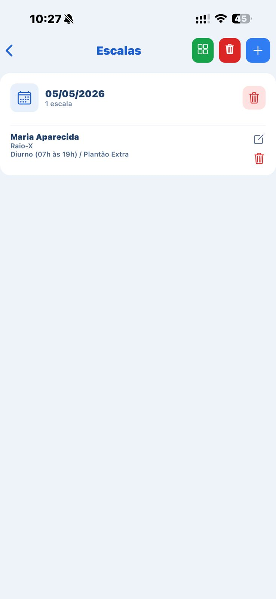

# 🏥 UMS Escalas
Sistema mobile desenvolvido para gerenciamento de escalas hospitalares.

📍 Utilizado em ambiente real
📱 Aplicação mobile
⚡ Backend integrado ao Supabase
🔐 Controle de acesso por perfil


## 🚧 Status do projeto

✅ MVP concluído

Sistema utilizado para gestão de escalas hospitalares, banco de horas e trocas de plantão.

Novas funcionalidades continuam sendo desenvolvidas.

---

## Arquitetura

Frontend:
- React Native
- Expo
- TypeScript

Backend:
- Supabase
- PostgreSQL

Autenticação:
- Supabase Auth

## 🚀 Tecnologias

- React Native
- Expo
- JavaScript
- Supabase

---

## 📱 Funcionalidades

- Cadastro de funcionários
- Criação de escalas
- Troca de plantões
- Validação de dados (ex: COREN obrigatório)
- Interface otimizada para mobile

---
## Desafios Resolvidos

- Controle de acesso por perfil
- Banco de horas automatizado
- Regras específicas de escalas hospitalares
- Fluxo de trocas de plantão

---

## 📸 Preview

## 📸 Preview do App

<p align="center">
  
  
  
</p>

<p align="center">
  
  
  
</p>

## ⚙️ Como rodar o projeto

```bash
npm install
npx expo start
